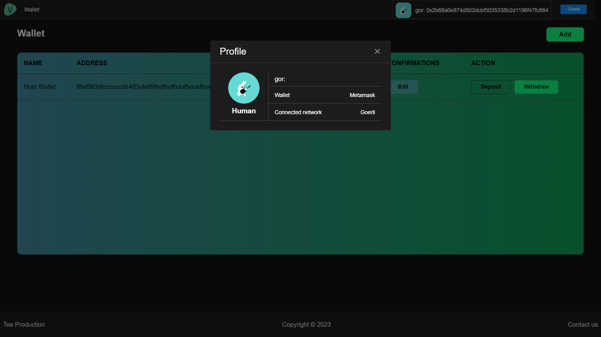
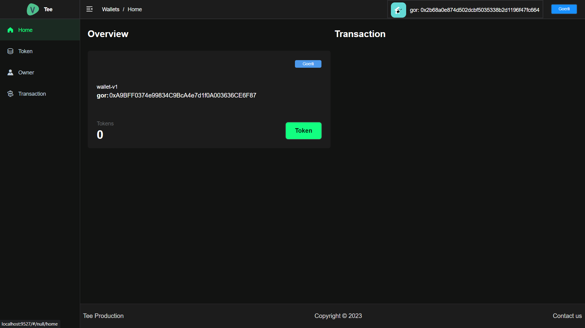
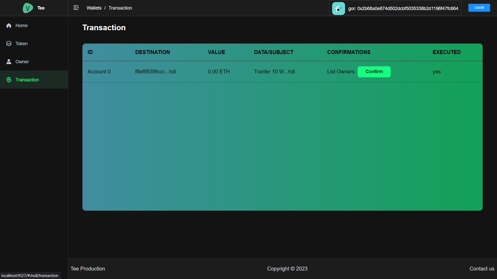

# MultiSig Wallet

## Introduction 
multisig-wallet is a production-ready front-end solution for wallet interfaces. It is based on [Metamask](https://github.com/MetaMask), [vue](https://github.com/vuejs/vue) and uses the UI Toolkit [element-ui](https://github.com/ElemeFE/element).


## Preparation

You need to install [node](https://nodejs.org/) and [git](https://git-scm.com/) locally. The project is based on [ES2015+](https://es6.ruanyifeng.com/), [vue](https://cn.vuejs.org/index.html), [vuex](https://vuex.vuejs.org/zh-cn/), [vue-router](https://router.vuejs.org/zh-cn/), [vue-cli](https://github.com/vuejs/vue-cli) , [axios](https://github.com/axios/axios) and [element-ui](https://github.com/ElemeFE/element), .
Understanding and learning this knowledge in advance will greatly help the use of this project.

## Getting started

```bash
# clone the project
git clone https://github.com/PanJiaChen/vue-element-admin.git

# enter the project directory
cd vue-element-admin

# install dependency
npm install

# develop
npm run dev
```
This will automatically open http://localhost:9527

## Online Demo

[Preview](https://panjiachen.github.io/vue-element-admin)

### Wallet page

### Home page of wallet 

### Transaction page of wallet

